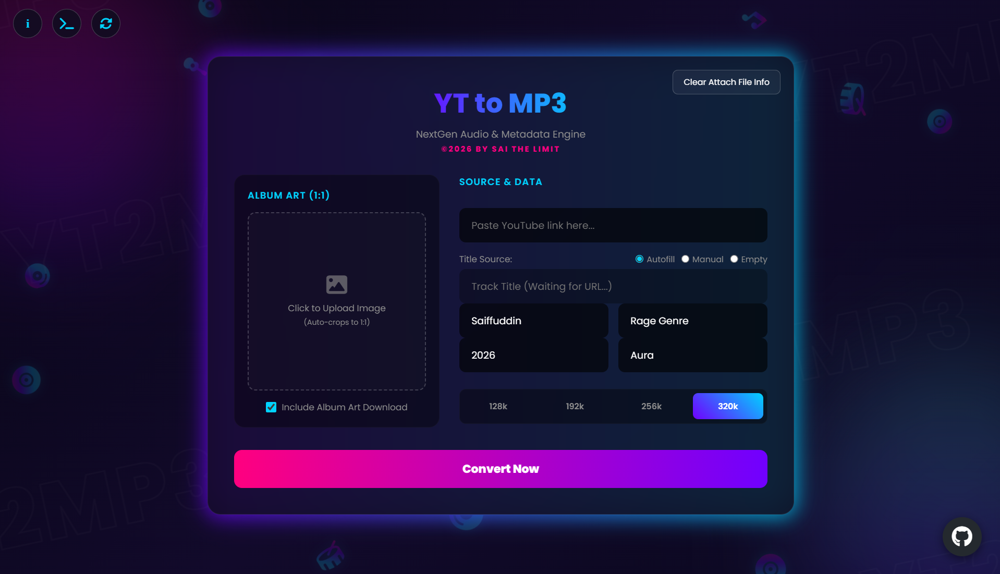

# 🚀 YT to MP3 — NextGen Audio & Metadata Engine (V1.0)

A sleek, high-performance, full-stack web application designed for seamless YouTube audio extraction and advanced ID3 metadata tagging. Built with a responsive neon cyber-themed frontend and a powerful Node.js backend runner.

---

## ✨ Features

- **High-Fidelity Extraction:** Extract high-quality audio files directly from YouTube links with selectable bitrates up to **320kbps**.
- **Automated ID3 Tagging:** Dynamically injects track title, artist name, album, release year, and genre details straight into the generated `.mp3` container.
- **Smart 1:1 Album Art Cropper:** Seamlessly upload custom cover artwork and crop it using an intuitive interactive overlay.
- **Sys-Terminal Logger Matrix:** View real-time server conversion metrics, chunk processing ratios, and underlying operations inside a beautiful integrated Matrix terminal drawer.
- **Wipe Data Cache Protection:** The "Clear Attach File Info" feature allows clearing local inputs instantly, decoupling active configuration memory before processing single streams.
- **Persistent Local Preferences:** Remembers structural inputs (Artist, Album, Genre, Bitrate selections) using secure client-side database schemas for fast workflow returns.

---

## 🛠️ Tech Stack & Architecture

- **Frontend:** HTML5, CSS3 (Custom `@keyframes` layouts, floating audio nodes), Native JavaScript (ES6+), IndexedDB, Canvas API (Matrix rain simulation), [Cropper.js](https://cdnjs.com/libraries/cropperjs) for image manipulation.
- **Backend:** Node.js, [Express](https://expressjs.com/), CORS middleware layer, UUID generators.
- **Core Processing Engine:** [youtube-dl-exec](https://github.com/micah5/youtube-dl-exec) wrapper utilizing optimized underlying binaries (`yt-dlp`), and [node-id3](https://github.com/Zazama/node-id3) for binary audio frame modifications.

---

## ⚙️ Installation & Setup

Ensure you have [Node.js](https://nodejs.org/) installed on your machine before commencing initialization.

### 1. Clone the Repository
```bash
git clone [https://github.com/sfmuhammmad327-wq/YT2MP3-V1.0.git](https://github.com/sfmuhammmad327-wq/YT2MP3-V1.0.git)
cd YT2MP3-NextGen
```

### 2. Install Project Dependencies
Run the command below within your project directory to provision the mandatory modules:

```bash
npm install express cors uuid youtube-dl-exec node-id3
```

### 3. Ensure System-Level Binaries Are Configured
Because the core uses youtube-dl-exec under the hood, make sure your deployment environment has valid media formats available or allows execution permission boundaries for runtime updates.

### 4. Boot Up the Conversion Engine
Kickstart your local backend daemon controller:

```Bash
node server.js
```
The console will display:

```Plaintext
NextGen Converter Engine running on [http://127.0.0.1:5000](http://127.0.0.1:5000)
Waiting for tasks...
```

### 5. Launch the Client Interface
Open yt2mp3.html directly inside any modern web browser or host it via local static serving options.

## 📂 Project Structure

```Plaintext
├── server.js          # Core Express web server & stream execution pipelines
├── yt2mp3.html        # Interactive cyber-neon user interface & state machinery
├── Saiffuddin.png     # Developer profile avatar reference asset
├── yt2mp3.ico         # Application tab brand favicon identifier
└── temp/              # Auto-generated runtime storage directory (git-ignored)
```

## 🔒 License & Disclaimer
This engine is created solely for personal media aggregation, localized caching, and educational testing frameworks. Please ensure you possess the legitimate authorization or downloading permission for any intellectual properties fetched via external references.

## 👑 Credit
Designed and developed with absolute passion by:

Muhammad Saiffuddin Bin Ahmad Fauzi Known as Sai the Limited

🚀 High-Tier Competitive Strategy & Graphics Systems Engineer

📧 Inquiries: sfmuhammmad327@gmail.com

🌐 GitHub Profile: @sfmuhammmad327-wq

© 2026 BY SAI THE LIMIT. All Rights Reserved.
